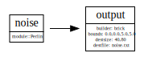

# noisetool
Command-line program surrounding libnoise.

## Introduction
noisetool reads a file defining a noise generator network, builds the noise network, and uses noiseutils classes to output either a BMP image, a Terragen file, or an OpenSCAD-compatible heightmap as a text file (added by noistool).  noisetool will also optionally generated a dot-readable digraph file for production of a DAG diagram.

The OpenSCAD heightmap option also has the option to perform "edge-degeneration" of the heightmap topology to taper it to 0 at the edges. This is helpful to make bricks with stone textures, the reason I took on libnoise in the first place.  The taper profile is produced using Tino Kludge's spline.h code, which originally used in my rawproc raw image processor for the control-point curve tool;  it is incorporated here under the terms and conditions of the GPL V2 license.

Note: as of 1/4/2025, noisetool is an incomplete incorporation of libnoise, not all of the available libnoise modules are exposed in the network file definition syntax.  Still adding modules...

## Building

The only prerequisite for noisetool is libnoise, which can be built by the noisetool CMake build system by supplying the -DBUILD_LIBNOISE option. This option takes one of three values: 

- GITHUB, which clones and builds libnoise from the GitHub repo,
- SRCPKG, which downloads the master branch from the GitHub repo and builds it, or
- (path/to/libnois_src.zip), which unpacks a local copy of the source zip file and builds it

If BUILD_LIBNOISE is not used, the build system will look for the library in the system locations.

So, for Linux:

    cmake -DBUILD_LIBNOISE=GITHUB ..

or, for Windows/MSYS2:

    cmake -G "MSYS Makefiles" -DBUILD_LIBNOISE=GITHUB ..

## Usage

    $ noisetool networkfile destfile=file.ext

.ext can be either a BMP, TER, or TXT, to produce an image, terragen, or OpenSCAD heightmap text file.

### Network File Syntax

The network file contains, in order: 1) node definitions, 2) connector definitions, 3) an output definition.

A simple Perlin noise generator would look like this:

```
perlin:name=noise
output:module=noise;builder=brick;bounds=0.0,0.0,5.0,5.0;destsize=40,80;destfile=noise.txt
```

This file contains one connection, from the one noise module to the output specification.  Other connections would be specified like this:

```
connect:sourcename,sinkname,instancenumber
```
To produce a digraph, run the following:

    $ ./noisetool perlin.txt digraph | dot -Tsvg -o perlin.svg

Looks like this:



Running:

    $ ./noisetool perlin.txt

will produce the file noise.txt, as specified in the destfile paramter in the network file.

Selected output parameters can be specified in the command line, replacing the associated parameter value in the network file.  For instance:

    $ ./noisetool perlin.txt destfile:newnoise.txt

will produce the newnoise.txt file instead of noise.txt.

Particularly, bounds and destsize can be used to randomize selection of those paramters to produce a sequence of output files that differ in
their noise patterns.  This requires advanced shell scripting.

ToDo: More comprehensive user documentation.


    

